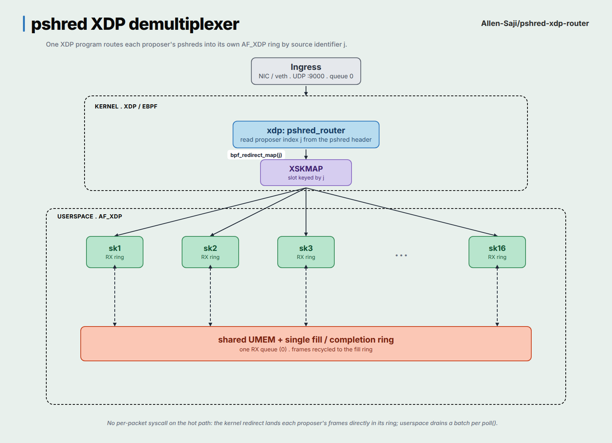

# pshred XDP router

An XDP packet router that demultiplexes pshred traffic by source identifier:
the proposer index `j` carried in the UDP payload. The kernel program reads `j`
from each pshred and `bpf_redirect_map`s the frame into an `XSKMAP` slot keyed
by `j`. Userspace runs one AF_XDP socket per proposer, all sharing a single
UMEM on one RX queue, so each proposer's pshreds land in their own ring with no
per-packet syscall on the hot path.

The pshred wire format follows the Solana Constellation white paper (v0.9,
Definition 3). The project was built as a Turbin3 Advanced SVM exercise.



## Wire format

Constellation Definition 3: `(e, c, j, t, i, h, rt, (d_i, pi_i), sigma_t)`. The
fixed header is 158 bytes, little-endian, packed (defined in
`pshred-router-common`):

| off | size | field          | sym     | type     |
|----:|-----:|----------------|---------|----------|
|   0 |    8 | epoch          | e       | u64      |
|   8 |    8 | cycle          | c       | u64      |
|  16 |    2 | proposer index | j       | u16      |
|  18 |    8 | pslice index   | t       | u64      |
|  26 |    4 | shred index    | i       | u32      |
|  30 |   32 | tx commitment  | h       | [u8; 32] |
|  62 |   32 | Merkle root    | rt      | [u8; 32] |
|  94 |   64 | Ed25519 sig    | sigma_t | [u8; 64] |

The variable `(d_i, pi_i)` erasure tail follows the fixed header and is not
parsed by the router.

### Deviations from the white paper

1. Field order. Definition 3 places `sigma_t` after the erasure tail. This
   serialisation puts `sigma_t` before the tail so the whole fixed header is
   contiguous and every demux field sits at a constant offset for the XDP fast
   path. The paper specifies a tuple, not a byte layout, so this is a
   serialisation choice, not a protocol change.
2. `cycle` and `pslice` are `u64`. The cycle index is `unix_nanos / 50_000_000`
   (section 3.2), about 3.5e10 today, past `u32::MAX`. The pslice index `t` is
   global and bound by Eq. (1) `(c-1)*mu < t <= c*mu`, so `t` is about 1.4e11.
   Both need `u64`.
3. Little-endian wire (Solana/bincode convention). The kernel reads fields with
   `from_le_bytes` over bounded slices, so parsing is alignment-safe.

## Action policy (kernel)

| condition                                     | action                       |
|-----------------------------------------------|------------------------------|
| non-IPv4 / non-UDP / dst != 9000 / too short  | `XDP_PASS`                   |
| Equation (1) violated                         | `XDP_DROP` (+`eq1_drop`)     |
| proposer `j == 0` or `j > 16`                 | `XDP_DROP` (+`range_drop`)   |
| valid pshred, socket bound at `j`             | `XDP_REDIRECT` (+`redirected`) |
| valid pshred, no socket bound at `j`          | `XDP_PASS` (+`no_socket`)    |

Counters live in the per-CPU `STATS` map; indices are shared with userspace via
`pshred_router_common::stats`, so the two sides cannot drift.

## Layout

```
pshred-router-common/      wire format, offsets, Eq. (1), stat indices
  examples/baseline_recv.rs  per-syscall UDP baseline for the benchmark
pshred-router-ebpf/        the XDP program (XSKMAP redirect demux)
pshred-router/             userspace loader
  src/main.rs                CLI, load + attach, path selection
  src/afxdp.rs               per-proposer AF_XDP sockets + drain loop
  src/stats.rs               STATS counter reads
xtask/                     dev tasks: setup, build, check
scripts/veth.sh            veth + netns lab up/down
send_shred.sh              pshred packet generator
```

## Build

Requires nightly + `rust-src` + `bpf-linker` (the toolchain is pinned in
`rust-toolchain.toml`):

```
cargo xtask setup                    # install nightly, rust-src, bpf-linker
cargo build -p pshred-router         # builds the eBPF object and the loader
cargo test  -p pshred-router-common  # wire-format and Eq. (1) unit tests
cargo xtask check                    # clippy across all targets
```

## Run (veth + netns lab, needs root)

```
sudo ./scripts/veth.sh up                                   # veth0 <-> veth1 (netns pshred)
sudo ip netns exec pshred ./target/debug/pshred_router -i veth1
# in another shell (root ns):
./send_shred.sh 10.0.0.2 3 1000          # 1000 pshreds, proposer 3 -> ring 3
./send_shred.sh 10.0.0.2 99 10           # proposer out of range -> range_drop
./send_shred.sh 10.0.0.2 3 10 --bad-eq1  # Equation (1) violation -> eq1_drop
sudo ./scripts/veth.sh down
```

`--no-xsk` attaches the program and prints only the `STATS` counters (no
AF_XDP). It is the quickest end-to-end check of the demux decision logic:

```
sudo ip netns exec pshred ./target/debug/pshred_router -i veth1 --no-xsk
```

## Benchmark (kernel-bypass gain)

Baseline is one `recv()` syscall per packet with XDP detached:

```
cargo build --release -p pshred-router-common --example baseline_recv
sudo ip netns exec pshred ./target/release/examples/baseline_recv 10.0.0.2 9000   # reports pkt/s
# flood from the root ns and watch pkt/s and CPU (pidstat -p <pid> 1)
```

Then run the AF_XDP loader under the same flood and compare pkt/s and CPU. See
Performance below for measured results, including why copy-mode veth does not
show a CPU win.

## Performance

Measured on the veth + netns lab (single RX queue, copy mode), one flooding
thread against one receiver thread:

    path                offered       delivered      ring loss   receiver CPU
    recv() per packet   ~288k pkt/s   ~288k pkt/s    0           ~59% of one core
    AF_XDP redirect     ~358k pkt/s   ~339k pkt/s    0           ~99% of one core

The router demuxes losslessly: every packet the kernel hands the XDP program is
redirected and drained (total == redirected, no_socket == 0). The small offered
vs delivered gap is upstream loss on the veth TX path, not the router.

This is not a CPU win on veth, by design. veth has no DMA, so the kernel only
moves frames into the RX ring while userspace is actively polling it. A loop
that sleeps to save CPU starves delivery and drops most of the traffic. The
AF_XDP advantage - block in poll(), wake once per batch - needs a NIC with
native XDP and zero-copy, where hardware fills the ring independently of the
application. The same loop then blocks at idle and amortizes a burst per wakeup.

## Status

- The eBPF object compiles to a valid BPF ELF (`xdp` program + `XSKS`/`STATS`
  maps).
- `pshred-router-common` unit tests pass (format round-trip, Eq. (1) including
  realistic ~1e11 values).
- The userspace loader compiles clean under clippy.
- The full redirect path is verified on a veth + netns lab: sending 1000/500/250
  pshreds to proposers 3/5/12 lands exactly p3=1000, p5=500, p12=250 in the
  per-proposer rings (`redirected=1750`), with an out-of-range proposer and an
  Equation (1) violation dropped (`range_drop`, `eq1_drop`) and nothing
  misrouted. Reproduce with the steps above.

